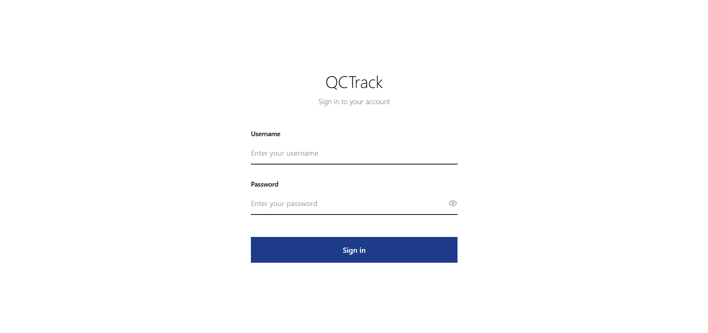
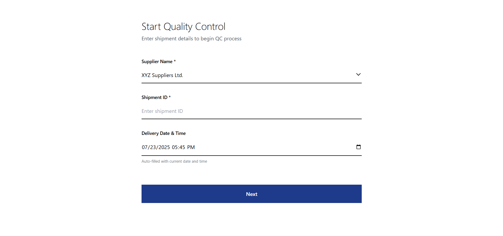
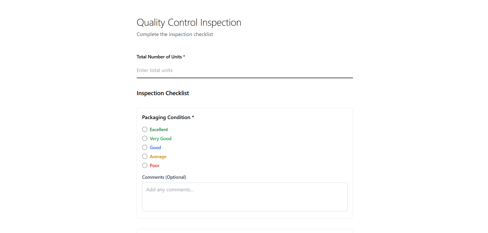
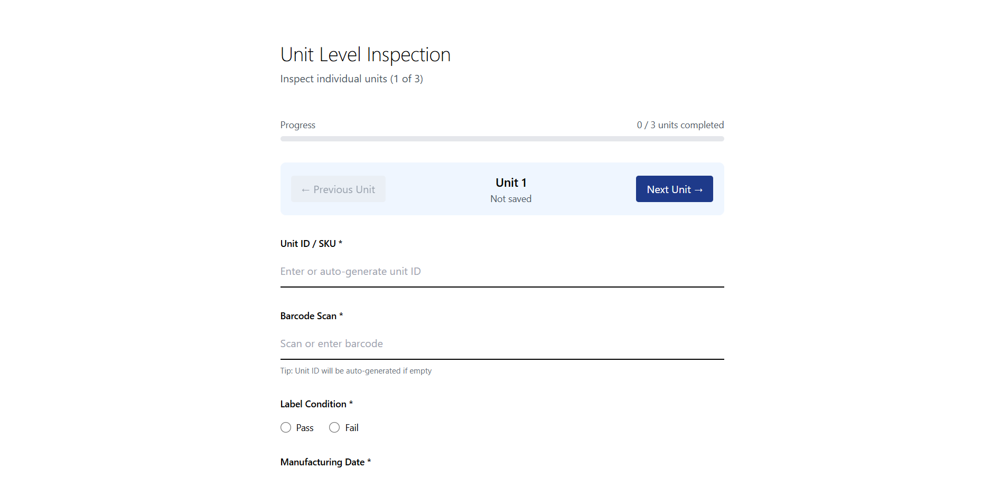

<div align="center" markdown="1">
	<h1>QCTrack</h1>

**QCTrack — Smart Quality Control Inspection Management for Modern Manufacturing Ops**
</div>

<br>
<div align="center">
	
</div>
<br>

## QCTrack

**QCTrack** is a robust web-based application designed to streamline and manage Quality Control (QC) inspections for incoming shipments and individual units. It provides a structured, intuitive interface for recording critical inspection data, ensuring product quality and compliance throughout the receiving process.

Built with a modern **React.js** frontend and a powerful **Node.js/Express.js** backend utilizing **MongoDB** for data persistence, QCTrack offers a reliable solution for comprehensive quality assurance.

## 🚀 Motivation

Manual or disparate QC processes can lead to errors, inefficiencies, and delayed inventory processing.  
**QCTrack** was developed to address these challenges by providing a centralized, digital platform for:

- **Standardizing Inspection Workflows**  
  Ensuring consistent data capture for every shipment and unit.

- **Improving Data Accuracy**  
  Reducing human error through structured inputs and validation.

- **Enhancing Visibility**  
  Providing clear records of inspection outcomes for auditing and decision-making.

- **Boosting Efficiency**  
  Accelerating the inspection process with a user-friendly interface.

---

## ✨ Key Features

- **Shipment-Level QC Inspection**  
  Capture key shipment details and evaluate packaging, quantity match, damages, and invoice compliance with comments.

- **Unit-Level Inspection**  
  Log unit-specific information like SKU, barcode, label condition, and manufacturing/expiry dates.

- **Automated Unit ID Generation**  
  Auto-generate Unit IDs from scanned barcodes to streamline inspection data entry.

- **Inspection Progress Tracking**  
  Track inspection progress at the unit level within each shipment in real time.

- **Robust Data Persistence**  
  Store all shipment and unit inspection data securely in MongoDB with relational linking for efficient retrieval.

- **Responsive User Interface**  
  Navigate smoothly through a clean, mobile-friendly UI built with React.js and Tailwind CSS.

- **Secure Authentication**  
  Protect user sessions with client-side login, password hashing via bcrypt.js, and role-based access control.


<details>
<summary>Preview</summary>

  
  


</details>

---

## 🛠️ Getting Started

Follow these steps to clone the repository and run **QCTrack** locally on your machine.

---

### 🔁 1. Clone the Repository

```bash
git clone https://github.com/siddharthkhati/QCTrack.git
cd QCTrack
```

### 🔧 2. Backend Setup

```bash
cd backend
npm install
```

**📁 Create a .env file inside the backend/ folder and add the following:**

```bash
MONGO_URI="mongodb://localhost:27017/qctrack_db"
PORT=4000
JWT_SECRET="your_jwt_secret"
```

### 🔁 3. Start the Backend Server

```bash
npm run dev
# or
nodemon index.js
```

### 🔁 4. Frontend Setup

```bash
cd ../frontend
npm install
```

### 🔁 5. Start the Frontend Server

```bash
npm start
```